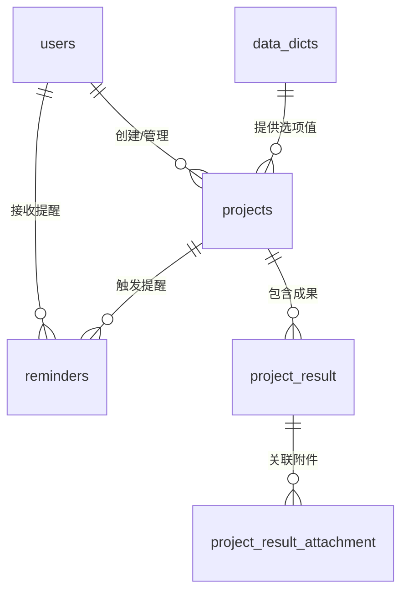

# 科研项目管理系统 - 数据库结构详细说明

## 📊 数据库概览

### 基本信息
- **数据库名称**: `research_project_db`
- **字符集**: `utf8mb4` (支持完整Unicode字符)
- **存储引擎**: `InnoDB` (支持事务和外键)
- **表数量**: 7个核心表
- **外键关系**: 6个主要关联

### 表结构清单

| 表名 | 功能描述 | 主键 | 外键 | 记录数 |
|------|----------|------|------|--------|
| `users` | 用户信息管理 | `id` | - | 系统用户 |
| `projects` | 项目基本信息 | `id` | - | 项目记录 |
| `project_result` | 项目成果信息 | `id` | `project_id` | 成果记录 |
| `project_result_attachment` | 成果附件文件 | `id` | `project_result_id` | 附件记录 |
| `reminders` | 项目提醒系统 | `id` | `project_id` | 提醒记录 |
| `data_dicts` | 数据字典配置 | `id` | - | 字典项 |
| `help_docs` | 帮助文档管理 | `id` | - | 文档记录 |
| `system_config` | 系统配置参数 | `id` | - | 配置项 |

## 🔗 表关系图

### 实体关系图 (ERD)



### 关系说明

1. **用户-项目关系** (1:N)
   - 一个用户可以管理多个项目
   - 通过用户ID隐式关联

2. **项目-成果关系** (1:N)
   - 一个项目可以有多个成果
   - 外键约束确保数据完整性

3. **成果-附件关系** (1:N)
   - 一个成果可以有多个附件文件
   - 支持文件服务器集成

4. **项目-提醒关系** (1:N)
   - 一个项目可以有多个提醒设置
   - 支持多种提醒类型和方式

## 🏗️ 详细表结构

### 1. 用户表 (`users`)

#### 字段结构
```sql
CREATE TABLE users (
    id INT AUTO_INCREMENT PRIMARY KEY,
    username VARCHAR(50) UNIQUE NOT NULL COMMENT '用户名',
    password VARCHAR(64) NOT NULL COMMENT '密码（加密存储）',
    real_name VARCHAR(50) NOT NULL COMMENT '真实姓名',
    role VARCHAR(20) DEFAULT 'user' COMMENT '角色：admin/user',
    status VARCHAR(20) DEFAULT 'active' COMMENT '状态：active/inactive',
    email VARCHAR(100) COMMENT '邮箱地址',
    phone VARCHAR(20) COMMENT '联系电话',
    last_login TIMESTAMP COMMENT '最后登录时间',
    create_time TIMESTAMP DEFAULT CURRENT_TIMESTAMP COMMENT '创建时间',
    update_time TIMESTAMP DEFAULT CURRENT_TIMESTAMP ON UPDATE CURRENT_TIMESTAMP COMMENT '更新时间'
);
```

#### 索引设计
- **主键索引**: `PRIMARY KEY (id)`
- **唯一索引**: `UNIQUE KEY uk_username (username)`
- **普通索引**: `KEY idx_status (status)`
- **时间索引**: `KEY idx_create_time (create_time)`

### 2. 项目表 (`projects`)

#### 字段结构
```sql
CREATE TABLE projects (
    id INT AUTO_INCREMENT PRIMARY KEY,
    project_name VARCHAR(255) UNIQUE NOT NULL COMMENT '项目名称',
    leader VARCHAR(50) NOT NULL COMMENT '项目负责人',
    department VARCHAR(50) NOT NULL COMMENT '所属部门',
    phone VARCHAR(20) NOT NULL COMMENT '联系电话',
    project_source VARCHAR(50) NOT NULL COMMENT '项目来源',
    project_type VARCHAR(50) NOT NULL COMMENT '项目类型',
    level VARCHAR(20) NOT NULL COMMENT '项目级别',
    funding_amount DECIMAL(15,2) NOT NULL COMMENT '资助金额',
    funding_unit VARCHAR(100) NOT NULL COMMENT '资助单位',
    approval_year VARCHAR(20) NOT NULL COMMENT '批准年份',
    project_number VARCHAR(50) NOT NULL COMMENT '项目编号',
    start_date DATE NOT NULL COMMENT '开始日期',
    end_date DATE NOT NULL COMMENT '结束日期',
    status VARCHAR(20) DEFAULT '进行中' COMMENT '项目状态',
    create_time TIMESTAMP DEFAULT CURRENT_TIMESTAMP COMMENT '创建时间',
    update_time TIMESTAMP DEFAULT CURRENT_TIMESTAMP ON UPDATE CURRENT_TIMESTAMP COMMENT '更新时间'
);
```

#### 索引设计
- **主键索引**: `PRIMARY KEY (id)`
- **唯一索引**: `UNIQUE KEY uk_project_name (project_name)`
- **复合索引**: `KEY idx_leader_status (leader, status)`
- **时间索引**: `KEY idx_end_date (end_date)`
- **来源索引**: `KEY idx_project_source (project_source)`

### 3. 项目成果表 (`project_result`)

#### 字段结构
```sql
CREATE TABLE project_result (
    id INT AUTO_INCREMENT PRIMARY KEY,
    project_id INT NOT NULL COMMENT '关联项目ID',
    type VARCHAR(20) NOT NULL COMMENT '成果类型',
    name VARCHAR(255) NOT NULL COMMENT '成果名称',
    date DATE NOT NULL COMMENT '成果日期',
    FOREIGN KEY (project_id) REFERENCES projects(id) ON DELETE CASCADE
);
```

#### 索引设计
- **主键索引**: `PRIMARY KEY (id)`
- **外键索引**: `KEY idx_project_id (project_id)`
- **类型索引**: `KEY idx_type (type)`
- **时间索引**: `KEY idx_date (date)`

### 4. 成果附件表 (`project_result_attachment`)

#### 字段结构
```sql
CREATE TABLE project_result_attachment (
    id INT AUTO_INCREMENT PRIMARY KEY,
    project_result_id INT NOT NULL COMMENT '关联成果ID',
    file_name VARCHAR(255) NOT NULL COMMENT '文件名',
    file_path VARCHAR(255) NOT NULL COMMENT '文件路径',
    file_server_host VARCHAR(255) NOT NULL COMMENT '文件服务器主机',
    file_server_port VARCHAR(255) NOT NULL COMMENT '文件服务器端口',
    file_storage_directory VARCHAR(255) NOT NULL COMMENT '存储目录',
    upload_time TIMESTAMP DEFAULT CURRENT_TIMESTAMP COMMENT '上传时间',
    FOREIGN KEY (project_result_id) REFERENCES project_result(id) ON DELETE CASCADE
);
```

#### 索引设计
- **主键索引**: `PRIMARY KEY (id)`
- **外键索引**: `KEY idx_project_result_id (project_result_id)`
- **文件索引**: `KEY idx_file_name (file_name)`

### 5. 提醒表 (`reminders`)

#### 字段结构
```sql
CREATE TABLE reminders (
    id INT AUTO_INCREMENT PRIMARY KEY,
    project_id INT NOT NULL COMMENT '关联项目ID',
    project_name VARCHAR(255) NOT NULL COMMENT '项目名称',
    reminder_type VARCHAR(20) NOT NULL COMMENT '提醒类型',
    days_before INT NOT NULL COMMENT '提前天数',
    reminder_way VARCHAR(20) NOT NULL COMMENT '提醒方式',
    content TEXT COMMENT '提醒内容',
    start_date DATE NOT NULL COMMENT '开始日期',
    status VARCHAR(10) DEFAULT '未读' COMMENT '提醒状态',
    create_time TIMESTAMP NOT NULL COMMENT '创建时间',
    FOREIGN KEY (project_id) REFERENCES projects(id) ON DELETE CASCADE
);
```

#### 索引设计
- **主键索引**: `PRIMARY KEY (id)`
- **外键索引**: `KEY idx_project_id (project_id)`
- **状态索引**: `KEY idx_status (status)`
- **时间索引**: `KEY idx_start_date (start_date)`

### 6. 数据字典表 (`data_dicts`)

#### 字段结构
```sql
CREATE TABLE data_dicts (
    id INT AUTO_INCREMENT PRIMARY KEY,
    dict_type VARCHAR(50) NOT NULL COMMENT '字典类型',
    dict_key VARCHAR(50) NOT NULL COMMENT '字典键',
    dict_value VARCHAR(100) NOT NULL COMMENT '字典值',
    sort_order INT DEFAULT 0 COMMENT '排序',
    is_active TINYINT(1) DEFAULT 1 COMMENT '是否激活',
    description VARCHAR(200) COMMENT '描述',
    create_time TIMESTAMP DEFAULT CURRENT_TIMESTAMP COMMENT '创建时间',
    update_time TIMESTAMP DEFAULT CURRENT_TIMESTAMP ON UPDATE CURRENT_TIMESTAMP COMMENT '更新时间'
);
```

#### 索引设计
- **主键索引**: `PRIMARY KEY (id)`
- **复合唯一索引**: `UNIQUE KEY uk_dict_type_key (dict_type, dict_key)`
- **类型索引**: `KEY idx_dict_type (dict_type)`
- **状态索引**: `KEY idx_is_active (is_active)`

### 7. 帮助文档表 (`help_docs`)

#### 字段结构
```sql
CREATE TABLE help_docs (
    id INT AUTO_INCREMENT PRIMARY KEY,
    title VARCHAR(255) NOT NULL COMMENT '文档标题',
    content TEXT COMMENT '文档内容',
    version VARCHAR(20) COMMENT '文档版本',
    create_time TIMESTAMP DEFAULT CURRENT_TIMESTAMP COMMENT '创建时间',
    update_time TIMESTAMP DEFAULT CURRENT_TIMESTAMP ON UPDATE CURRENT_TIMESTAMP COMMENT '更新时间'
);
```

### 8. 系统配置表 (`system_config`)

#### 字段结构
```sql
CREATE TABLE system_config (
    id INT AUTO_INCREMENT PRIMARY KEY,
    config_key VARCHAR(100) UNIQUE NOT NULL COMMENT '配置键',
    config_value TEXT COMMENT '配置值',
    description VARCHAR(200) COMMENT '描述',
    update_time TIMESTAMP DEFAULT CURRENT_TIMESTAMP ON UPDATE CURRENT_TIMESTAMP COMMENT '更新时间'
);
```

## 🎯 数据字典配置示例

### 项目来源配置
```sql
INSERT INTO data_dicts (dict_type, dict_key, dict_value, sort_order) VALUES
('project_source', 'national', '国家级', 1),
('project_source', 'provincial', '省部级', 2),
('project_source', 'school', '校级', 3),
('project_source', 'enterprise', '企业合作', 4);
```

### 项目类型配置
```sql
INSERT INTO data_dicts (dict_type, dict_key, dict_value, sort_order) VALUES
('project_type', 'basic', '基础研究', 1),
('project_type', 'applied', '应用研究', 2),
('project_type', 'development', '开发研究', 3),
('project_type', 'policy', '政策研究', 4);
```

### 项目级别配置
```sql
INSERT INTO data_dicts (dict_type, dict_key, dict_value, sort_order) VALUES
('level', 'major', '重大项目', 1),
('level', 'key', '重点项目', 2),
('level', 'general', '一般项目', 3),
('level', 'youth', '青年项目', 4);
```

## 🔍 查询优化建议

### 常用查询索引
1. **项目查询优化**
   ```sql
   -- 按负责人和状态查询
   CREATE INDEX idx_leader_status ON projects(leader, status);
   
   -- 按结束日期范围查询
   CREATE INDEX idx_end_date ON projects(end_date);
   
   -- 按来源和类型查询
   CREATE INDEX idx_source_type ON projects(project_source, project_type);
   ```

2. **提醒系统优化**
   ```sql
   -- 按状态和日期查询提醒
   CREATE INDEX idx_status_date ON reminders(status, start_date);
   
   -- 按项目ID和状态查询
   CREATE INDEX idx_project_status ON reminders(project_id, status);
   ```

3. **数据字典优化**
   ```sql
   -- 按类型和激活状态查询
   CREATE INDEX idx_type_active ON data_dicts(dict_type, is_active);
   ```

## 📈 性能监控

### 表大小监控
```sql
-- 查看各表记录数
SELECT 
    table_name,
    table_rows,
    ROUND(data_length/1024/1024, 2) AS data_size_mb,
    ROUND(index_length/1024/1024, 2) AS index_size_mb
FROM information_schema.tables 
WHERE table_schema = 'research_project_db'
ORDER BY data_length DESC;
```

### 索引使用情况
```sql
-- 查看索引使用统计
SHOW INDEX FROM projects;
SHOW INDEX FROM reminders;
```

## 🛡️ 数据完整性约束

### 外键约束
- **projects → project_result**: 级联删除
- **projects → reminders**: 级联删除
- **project_result → project_result_attachment**: 级联删除

### 唯一约束
- `users.username`: 用户名唯一
- `projects.project_name`: 项目名称唯一
- `system_config.config_key`: 配置键唯一
- `data_dicts(dict_type, dict_key)`: 字典键唯一

### 检查约束
- `projects.end_date > projects.start_date`: 结束日期必须晚于开始日期
- `reminders.days_before >= 0`: 提前天数必须为非负数
- `data_dicts.sort_order >= 0`: 排序值必须为非负数

## 🔄 备份策略

### 自动备份脚本
```bash
#!/bin/bash
# 每日备份脚本
DATE=$(date +%Y%m%d_%H%M%S)
mysqldump -u username -p research_project_db > backup_${DATE}.sql
gzip backup_${DATE}.sql
find . -name "backup_*.sql.gz" -mtime +7 -delete
```

### 数据恢复
```sql
-- 恢复备份
mysql -u username -p research_project_db < backup_20241201_120000.sql
```

## 📋 版本控制

### 数据库版本记录
```sql
CREATE TABLE db_version (
    version VARCHAR(20) PRIMARY KEY,
    description TEXT,
    update_date TIMESTAMP DEFAULT CURRENT_TIMESTAMP
);

INSERT INTO db_version (version, description) VALUES
('1.0.0', '初始版本，包含基本表结构'),
('1.1.0', '添加提醒系统表'),
('1.2.0', '优化索引和查询性能');
```

---

**文档版本**: v1.0.0  
**创建日期**: 2024-12-01  
**更新日期**: 2024-12-01  
**维护人员**: 系统管理员