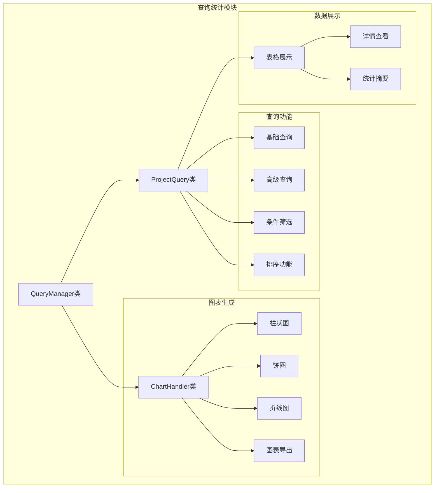

# 科研项目管理系统 - 完整架构图

## 系统总体架构

- 在线查看网址: https://mermaid.live


## 模块详细架构图

### 1. 用户界面架构


### 2. 项目管理模块架构


### 3. 查询统计模块架构



### 4. 提醒系统架构


### 5. 数据流架构图


### 6. 技术栈架构


## 部署架构图

### 单机部署架构


## 模块间调用关系图

### 核心调用链


## 配置文件架构

### 系统配置结构

```yaml
科研项目管理系统/
├── config/
│   ├── settings.py          # 系统配置
│   ├── config.json          # 数据库配置
│   └── qss/                 # 样式文件
├── data/
│   ├── db_connection.py     # 数据库连接
│   ├── models/              # 数据模型
│   └── dao/                 # 数据访问对象
├── ui/
│   ├── main_window.py       # 主窗口
│   ├── project_registration.py
│   ├── project_query.py
│   └── reminder_management.py
├── logic/
│   ├── auto_reminder.py     # 自动提醒
│   └── validators/          # 数据验证器
├── utils/
│   ├── logger.py            # 日志系统
│   ├── decorators.py        # 装饰器
│   └── helpers.py           # 工具函数
├── file_server/             # 文件服务器
├── logs/                    # 日志文件
└── docs/                    # 文档目录
```

## 性能架构设计

### 缓存机制


这个完整的架构图展示了科研项目管理系统从用户界面到数据存储的全栈架构，包含了前端界面、业务逻辑、数据访问、基础设施等各个层次的详细设计。系统采用分层架构模式，各层之间职责清晰，便于维护和扩展。